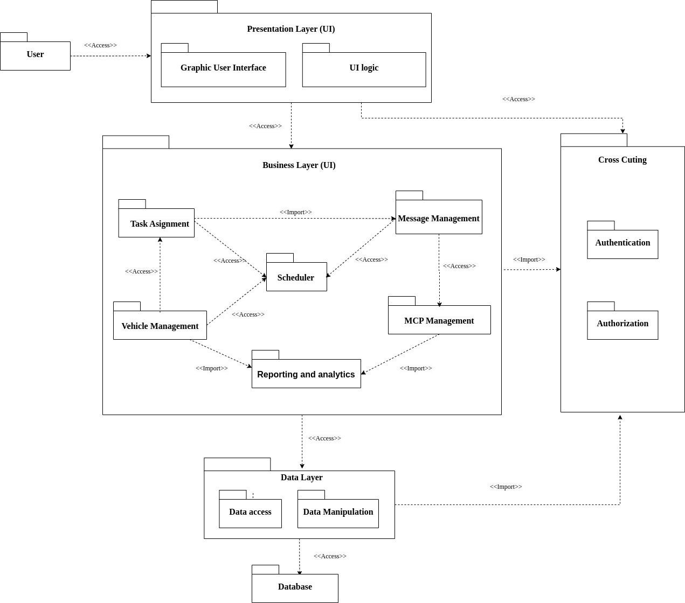

# Layered architecture

## Presentation strategy

Hệ thống UWC 2.0 tập trung vào việc cung cấp trải nghiệm liền mạch và thân thiện với người dùng bằng cách sử dụng giao diện thân thiện, hấp dẫn, trực quan và dễ điều hướng. Thiết kế giao diện người dùng được tối ưu hóa để hoạt động trên các thiết bị và kích thước màn hình khác nhau, đảm bảo rằng người dùng có thể truy cập hệ thống từ mọi nơi và mọi lúc.

Thông báo và cập nhật theo thời gian thực là một phần không thể thiếu trong chiến lược này, đảm bảo rằng người dùng luôn được thông báo về nhiệm vụ được giao, thay đổi thời gian biểu và cảnh báo quá tải MCP. Các cập nhật và thông báo này được thiết kế để cung cấp thông tin và có thể thực hiện được, cho phép người dùng nhanh chóng thực hiện các hành động thích hợp để giải quyết mọi vấn đề có thể phát sinh.

Các tùy chọn tùy chỉnh là một khía cạnh quan trọng khác của chiến lược. Hệ thống cho phép người dùng chọn ngôn ngữ, múi giờ và cài đặt thông báo ưa thích của họ, cho phép họ cá nhân hóa trải nghiệm và cải thiện năng suất của mình.

## Data storage approach

UWC có thể sử dụng giải pháp lưu trữ dữ liệu mạnh mẽ và có thể mở rộng, chẳng hạn như cơ sở dữ liệu dựa trên đám mây (MongoDB Cloud, Superbase, hoặc self-hosted) hoặc “distributed system". Các cách tiếp cận này phải có khả năng xử lý khối lượng dữ liệu lớn, hỗ trợ thông lượng cao và độ trễ thấp.

Dữ liệu phải được lưu trữ ở định dạng có cấu trúc và được chuẩn hóa (normalized format), để dễ dàng truy vấn và phân tích hiệu quả. Ngoài ra, UWC triển khai các cơ chế sao lưu và phục hồi thích hợp để đảm bảo tính khả dụng (availability) và độ bền (durability) của dữ liệu trong trường hợp xảy ra sự cố. Bằng cách áp dụng phương pháp lưu trữ dữ liệu được lên kế hoạch tốt, UWC có thể đảm bảo rằng dữ liệu an toàn, bảo mật và sẵn sàng để xử lý và phân tích.

## API management

Hệ thống sử dụng một cổng API an toàn cho phép người dùng truy cập vào các tài nguyên và API của hệ thống. Các API  phải được triển khai đi kèm với các cơ chế xác thực và ủy quyền, chẳng hạn như OAuth 2.0 (NextAuth của NextJS) hoặc JSON Web Tokens (JWT), để kiểm soát quyền truy cập vào API và bảo vệ dữ liệu nhạy cảm.

Hệ thống có thể sẽ cung cấp tài liệu API toàn diện và các công cụ kiểm tra để cho phép những lập trình viên khác dễ dàng tích hợp với hệ thống (swagger, documentation, …).
Hệ thống UWC 2.0 có thể tạo điều kiện tích hợp bên thứ ba và tăng khả năng sử dụng và áp dụng tổng thể của nó.

***Refs***: [Diagram source](https://drive.google.com/file/d/1_3r9Q08idlupg55sRbHADSKO0IuljHlX/view?usp=sharing)
