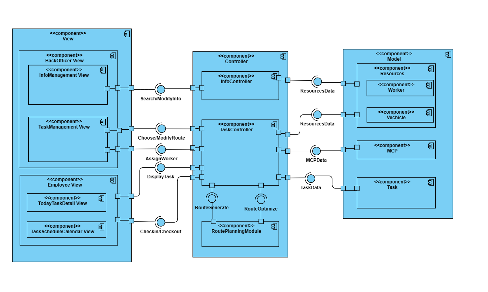

# Component diagram

## Component diagram description

Component Back Officer View có 2 method: InforManagement View và Task Management View.
    • InfoManagement View có interface cho phép Back Officer tìm kiếm thông tin của các MCPs, Janitor, Collector và chỉnh sửa thông tin của bản thân. Những yêu cầu này được gửi tới Component InfoController để component này tiếp cận và chỉnh sửa những thông tin ở cơ sở dữ liệu thông qua Component Resources.
    • TaskManagement View có interface cho phép Back Officer chọn, chỉnh sửa tuyến đường làm việc của Collector và phân công Janitors và Collectors vào các ngày phù hợp. Những chỉnh sửa và thay đổi này sẽ được gửi tới component TaskController để component này tiếp cận và chỉnh sửa những thông tin ở cơ sở dữ liệu thông qua lần lượt 3 component:
        ◦ Component Resources chỉnh sửa dữ liệu của các nhân viên và phương tiện.
        ◦ Component MCP chỉnh sửa dữ liệu của các MCP.
        ◦ Component Task chỉnh sửa thông tin các Task cần làm của nhân viên.

Riêng đối với các thao tác với tuyến đường mà Back Officer thực hiện, component TaskController có một sub component là RoutePlanning Module nhận input từ Back Officer và trả về Back Officer interface mà không thông qua các component tại Model.  
Component Employee View có 2 method: Today **TaskDetailView** và **TaskScheduleCalendarView**.
    • Today **TaskDetailView** và **TaskScheduleCalendarView** có interface lần lượt có các chức năng: cho phép nhân viên xem được công việc của bản thân ngày hôm đó và checkin/checkout bằng cách gửi lệnh yêu cầu tới component Task Controller để component này tiếp cận dữ liệu từ cơ sở dữ liệu thông qua component Task và component Worker.

***Refs***: [Diagram source](https://drive.google.com/file/d/1ixCv5lLisnLXTWILzvyXgYwEoHBM8V6j/view?usp=sharing)
