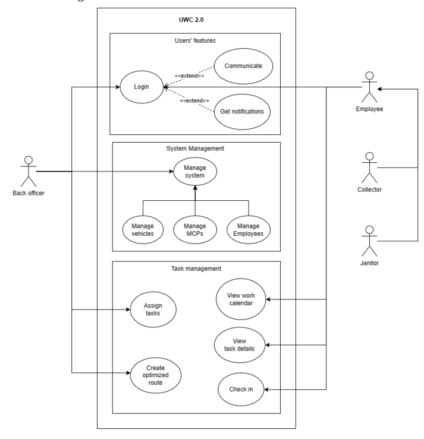

# Functional, non-functional and general use-case diagram

## Functional Requirements

- Back Officers:
  - Quản lý thông tin và lịch làm việc của janitors và collectors.
  - Quản lý thông tin và chi tiết kỹ thuật (tải trọng, sức chứa, mức tiêu thụ nhiên  liệu…) của các phương tiện vận chuyển.
  - Quản lý thông tin và sức chứa khả dụng của các địa điểm tập kết rác (MCPs)
  - Phân giao phương tiện vận chuyển cho janitors và collectors.
  - Phân bổ janitors và collectors cho công việc ở mỗi MCP.
  - Lập và tối ưu hóa lộ trình cho các collectors.
  - Có thể liên hệ bằng tin nhắn tới janitors và collectors.
- Collector & Janitor:
  - Xem được lịch làm việc của bản thân.
  - Xem được chi tiết công việc theo ngày và tuần của bản thân.
  - Có thể liên hệ bằng tin nhắn với back officers và collectors, janitors khác.
  - Check in/Check out công việc mỗi ngày.
  - Nhận thông báo khi MCP đã đầy

## Non-functional Requirements

- Hiệu suất:
  - Lộ trình thu gom rác phải tối ưu về lượng nhiên liệu tiêu thụ và khoảng cách di
  chuyển.
  - Với 1 người dùng tại 1 thời điểm:
  o Các tin nhắn trong thời gian thực phải được gửi với độ trễ nhỏ hơn 1s.
  o Các thao tác trên hệ thống được xử lý với độ trễ nhỏ hơn 1s.
  - Sức chứa khả dụng của MCPs phải được cập nhật mỗi 15 phút trong tối thiểu 95%
  thời gian vận hành của chúng.
  - Hệ thống có thể xử lí với 1000 MCPs trong thời gian thực ở thời điểm hiện tại và
  dự kiến với 10.000 MCPs trong 5 năm tới.
- Giao diện:
  - Hệ thống UWC 2.0 có thể tái sử dụng dữ liệu có sẵn từ UWC 1.0.
  - Task Management của UWC 2.0 có khả năng tương tác với UWC 1.0 nhiều nhất
  có thể.
  - Ngôn ngữ giao diện: tiếng Việt, có thể phát triển thêm tiếng Anh trong tương lai.
  - Chi tiết công việc của collectors và janitors phải có hai chế độ hiển thị, theo ngày
  và theo tuần. Ở mỗi chế độ hiển thị, các thông tin quan trọng cần được trình bày
  trên một trang mà không phải kéo xuống.

## Use-case diagram

