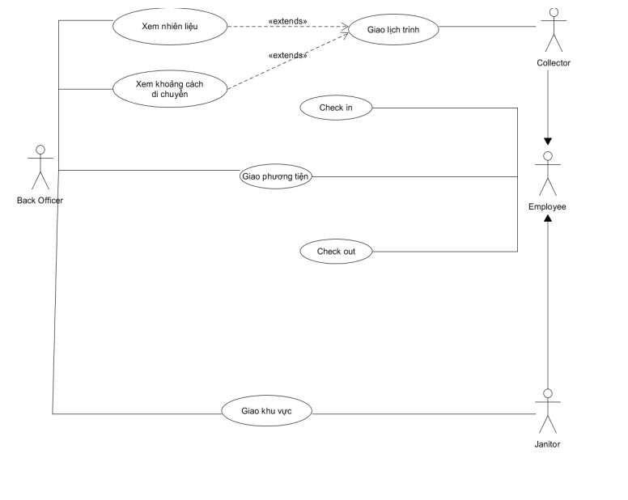

# Task assignment module's use-case diagram and the use-case using a table format

## Use-case diagram

## Use-case using a table format

|  Key | Value |
|  --- |   --- |
|  Use-case ID | U1  |
|  Use-case name | Giao lịch trình  |
| Use-case overview | Giao lịch trình phù hợp cho Collector |
| Actor(s) | Back Officer |  
| Preconditions | Biết được tình trạng của MCP, nhiên liệu và khoảng cách cần di chuyển |
| Steps | 1. Xem lịch của Collector và Janitor   2. Xem tình trạng phương tiện ( trọng tải, nhiên liệu).   3. Xem thông tin về MCP 4. Gửi lịch trình phù hợp cho Collector |
| Post Conditions | Collector nhận được lịch trình và thực hiện. |
| Exception Flow | Thông tin về MCP được cập nhật mỗi 15 phút, nếu sức chứa của MCP vượt quá 95%, Back Officer sẽ cập nhật lịch trình phù hợp và gửi cho Collector |

|  Key | Value |
|  --- |   --- |
|  Use-case ID | U2  |
|  Use-case name | Giao khu vực  |
| Use-case overview|  Giao khu vực cho Collector|
| Actor(s) | Back Officer |
| Preconditions|  Biết được tình trạng của khu vực cần thu gom và khoảng cách cần di chuyển.|
| Steps|  1. Xem lịch của Collector và Janitor   2. Xem thông tin về khu vực cần thu gom.   3. Gửi địa chỉ khu vực cần thu gom cho Janitor
| Post Conditions|  Janitor nhận được đia chỉ và tiến hành thu gom tại khu vực.|
| Exception Flow|  Không|
