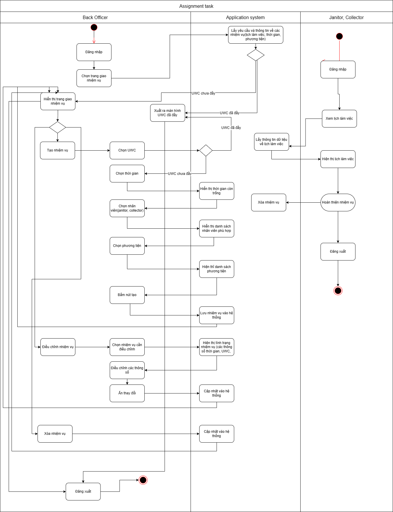

# Activity diagram

- Describe:
Có 2 điểm bắt đầu riêng biệt là 2 loại stackholder: back officer và (janitor, collector).
- Các hoạt động thêm, xóa, chỉnh sửa nhiệm vụ được tiến hành riêng biệt với nhau.
- Ở bên backofficer: đầu tiên là đăng nhập rồi gửi thông tin đến hệ thống. Hệ thống sẽ phải kiểm tra xem UWC đã đầy hay không. Nếu đầy thì xuất thông báo và có thể chọn đăng xuất để kết thúc. Nếu chưa thì sẽ hiện thị lịch làm việc theo từng điểm thu gom rác. Nhân viên sẽ có các lựa chọn thêm, xóa, chỉnh sửa các nhiệm vụ. Dữ liệu sẽ được cập nhật vào hệ thống sau mỗi lần thay đổi.
- Ở phía janitor và collector có thể xem nhiệm vụ và khi hoàn thành nhiệm vụ sẽ xóa và cập nhật vào hệ thống.

**Refs:** [here](https://drive.google.com/file/d/1n5bIdtK2mIJt2EMdR_Of_W_Ly1R0JPlP/view?usp=sharing)
