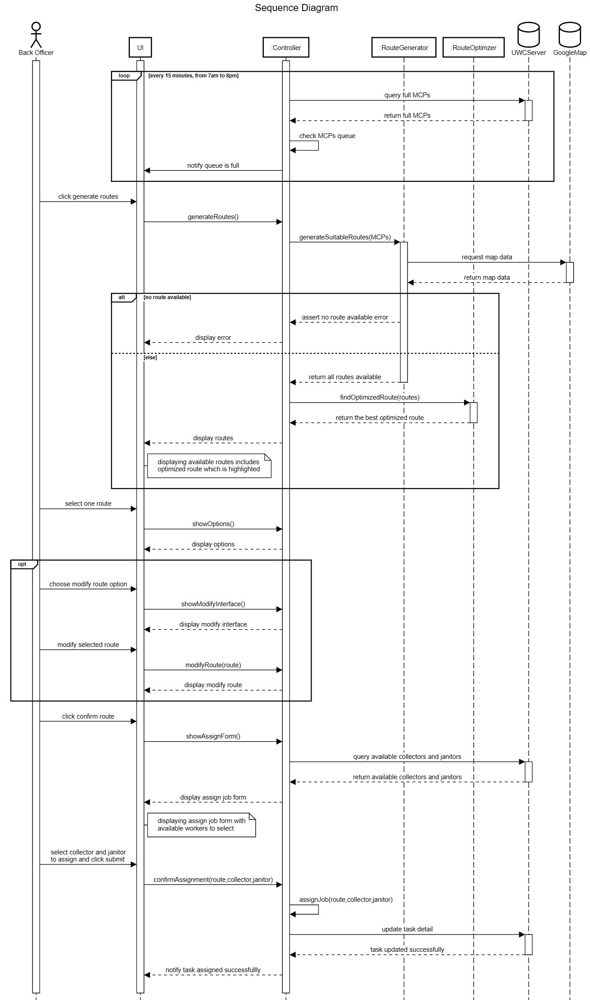

# Sequence diagram

- Describe:
Back Officers (BO) khi cần một lộ trình để Collector thu thập rác từ các MCPs, lộ trình hoạt động sẽ như sau:
− Mỗi ngày, từ 7 giờ sáng tới 8 giờ tối, mỗi 15 phút, Controller sẽ gửi một yêu cầu kiểm tra số MCPs đã đầy tới UWC Server. Nếu hàng đợi MCPs queue đã đầy thì Controller sẽ gửi thông báo tới UI để nhắc nhở BO tạo lộ trình.
− Trên giao diện người dùng của UWC 2.0, khi nhận được thông báo MCPs queue đã đầy, BO nhấn nút tạo lộ trình, một yêu cầu tạo lộ trình được gửi tới Controller. Controller sẽ gọi hàm generateSuitableRoutes() của class RouteGenerator để khởi tạo các tuyến đường hợp lý.
− Hàm này sẽ truy cập dữ liệu của Google Map để xử lý việc khởi tạo các tuyến đường. Nếu không có tuyến đường nào thỏa mãn được trả về, khi đó controller sẽ gửi thông báo lỗi ra màn hình.
− Ngược lại nếu các tuyến đường khả thi được trả về, Controller sẽ gọi hàm findOptimizedRoute() của class RouteOptimizer để tìm tuyến đường tối ưu nhất. Tuyến đường tối ưu nhất được trả về Controller. Sau đó Controller sẽ gửi danh sách các tuyến đường khả dĩ lên UI trong đó bao gồm cả tuyến đường tối ưu nhất được hiển thị nổi bật hơn các tuyến đường còn lại.
− Sau khi có danh sách các tuyến đường, BO sẽ lựa chọn một tuyến đường được hiển thị trên UI. Có được tuyến đường, Controller sẽ cho hiển thị các lựa chọn như chỉnh sửa hoặc xác nhận tuyến đường
− Nếu BO lựa chọn sửa đổi tuyến đường, UI sẽ gửi một yêu cầu tới Controller và Controller sẽ trả về giao diện các lựa chọn chỉnh sửa tuyến đường trên UI. Sau khi BO thực hiện các chỉnh sửa tuyến đường trên UI, UI sẽ gọi hàm modifyRoute() của  Controller để cập nhật tuyến đường đã sửa đổi, Controller sẽ gửi thông tin cho UI để hiển thị tuyến đường đã sửa.
− Sau đó BO sẽ lựa chọn xác nhận hoàn thành lựa chọn tuyến đường, một yêu cầu tìm kiếm những nhân viên phù hợp cho công việc của tuyến đường trên sẽ được UI gửi tới Controller. Controller sẽ truy xuất những dữ liệu này từ UWC Server. Controller sau khi nhận được dữ liệu sẽ hiển thị form lựa chọn phân công nhân viên lên UI.
− Khi đó, BO sẽ lựa chọn nhân viên để phân công tuyến đường trên và nhấn nút Submit. UI sẽ gửi yêu cầu xác nhận việc phân công đến Controller, Controller gọi hàm assignJob để liên kết các tuyến đường và collector và janitor được phân công tương ứng. Sau đó, Controller sẽ gửi yêu cầu cập nhật dữ liệu công việc lên UWC Server.
− Khi UWC Server hoàn thành cập nhật dữ liệu, Controller sẽ gửi thông báo đến UI rằng công việc đã được giao thành công

**Refs:** [here](https://drive.google.com/file/d/14hjKZUDLLEfPGBN3l2kQ_dtw8zCD6xK_/view?usp=sharing)
