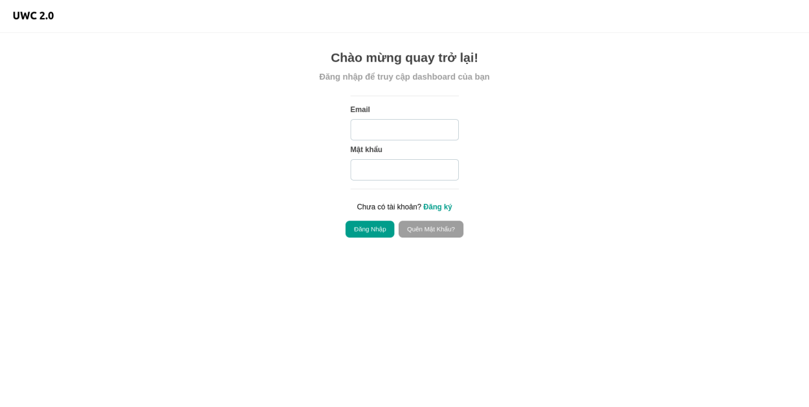
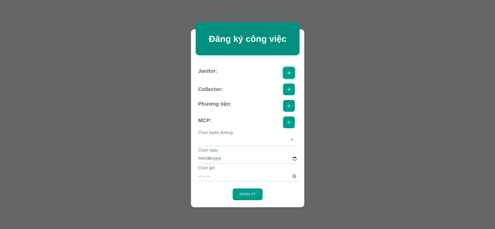
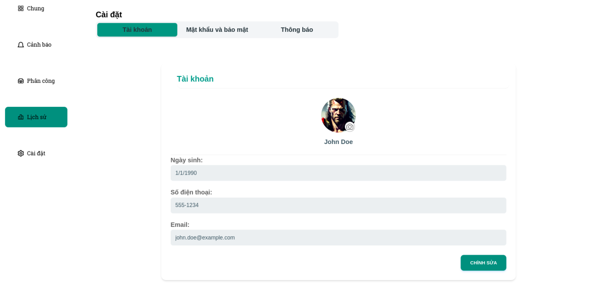

# Test report

>> Version <1.1> <04/07/2023>

| Version #| Implemented By   | Revision Date  | Approved By  | Approval Date   | Reason |
|-------------|---|---|---|---|---|
|1.0 |Nhóm 8| <03/30/2023 > |Nhóm 8| <03/30/2023> |Fixing|
|1.1 |Nhóm 8| <04/05/2023> |Nhóm 8| <04/07/2023> |Testing|

## Mục lục

1. Giới thiệu
    1.1 Tổng quát
    1.2 Mục đích
2. Tổng quan
    2.1 Trang đăng nhập
    2.2 Trang phân công
    2.3 Trang cài đặt
3. Phương thức
4. Kết quả
5. Phản hồi

## 1. GIỚI THIỆU

### 1.1 Tổng quát

Quản lý chất thải đô thị là một trong những vấn đề quan trọng mà nhiều quốc gia trên thế giới phải đối mặt. Do bối cảnh đô thị, việc quản lý chất thải rắn rất tốn kém và khơng hiệu quả. Từ đó, sự cải thiện trong việc quản lý chất thải là một trong những vấn đề quan trọng được chú ý trong Mục tiêu Phát triển Bền vững, đối với chính phủ các quốc gia và các tổ chức xã hội, vì những tác động tích cực đối với đời sống nói riêng và cả mơi trường nói chung.
Ở dự án này, công ty cung cấp dịch vụ quản lý chất thải Y ký kết với tổ chức X tạo ra một hệ thống quản lý rác thải đô thị (UWC) nhằm nâng cao hiệu quả công việc thu gom và quản lý chất thải.

### 1.2 Mục đích

UWC 2.0 Test Report để tổng kết lại kết quả của các bài test được thực hiện trong MVP 1

## 2. TỔNG QUAN

### 2.1 Trang đăng nhập

- Đăng nhập
- Lấy lại mật khẩu
- Đổi mật khẩu

### 2.2 Trang phân công

- Chọn Collector
- Chọn Janitor
- Chọn MCPs
- Chọn phương tiện
- Chọn lộ trình

### 2.3 Trang cài đặt

- Thay đổi Tên
- Thay đổi Ảnh đại diện
- Thay đổi Ngày sinh
- Thay đổi Số điện thoại
- Thay đổi Email

### 3. PHƯƠNG THỨC

### 3.1 In-person testing

Loại kiểm tra này bao gồm quan sát người dùng khi họ sử dụng ứng dụng trong môi trường tự nhiên của họ (ví dụ như ngay tại nơi làm việc). Kiểm tra trong môi trường thực tế có thể cung cấp thông tin quý giá về cách ứng dụng được sử dụng trong ngữ cảnh và có thể tiết lộ các vấn đề có thể không rõ ràng trong một môi trường thí nghiệm nhân tạo.

- Tuyển dụng các ứng viên như nhân viên sử dụng ứng dụng trong công việc hàng ngày của họ.
- Quan sát họ khi họ sử dụng ứng dụng để quản lý các nhiệm vụ được phân công và .
- Ghi chú bất kỳ vấn đề hoặc bất cập trong quá trình sử dụng ứng dụng nào mà họ gặp phải.
- Theo dõi và thu thập phản hồi và gợi ý của họ sau mỗi phiên kiểm tra, thường là sau mỗi ngày.

### 3.2 Remote testing

Remote testing cho phép bạn kiểm tra ứng dụng với người dùng về mặt địa lý, chẳng hạn như nhân viên làm việc từ xa hoặc ở các địa điểm khác nhau. Remote testing có thể được thực hiện bằng các công cụ khác nhau, chẳng hạn như chia sẻ màn hình, hội nghị truyền hình hoặc phần mềm kiểm tra tính sử dụng từ xa. Trong trường hợp của UWC 2.0 thì ta kiểm tra tính tương tác của các nhân viên trong quá trình sử dụng tại các địa điểm khác nhau và tính đồng nhất về mặt dữ liệu và thời gian.

- Tuyển dụng các ứng viên như nhân viên sử dụng ứng dụng tại các địa điểm khác nhau.
- Cung cấp cho họ quyền truy cập vào ứng dụng và bất kỳ hướng dẫn hoặc tài liệu cần thiết nào.
- Thực hiện phiên kiểm tra từ xa bằng cách sử dụng các công cụ chia sẻ màn hình. Qua đó đối chiếu sự đồng bộ của nhiều người sử dụng tại các địa điểm khác nhau.
- Thu thập phản hồi và gợi ý từ người tham gia sau phiên kiểm tra, thường là mỗi ngày. Đặc biệt chú ý sửa ngay các lỗi về tính đồng bộ sớm nhất có thể.

### 3.3 Kiểm tra định lượng (Quantitative testing)

Kiểm tra định lượng tập trung vào việc thu thập dữ liệu số về cách người dùng sử dụng ứng dụng, chẳng hạn như số lần họ truy cập, thời gian trung bình trên trang và tỷ lệ thoát khỏi trang. Đây là một loại kiểm tra định lượng được sử dụng để đánh giá tính sử dụng của ứng dụng trong một khía cạnh toàn diện.

- Cài đặt các công cụ theo dõi và phân tích để thu thập dữ liệu về tính sử dụng của ứng dụng.
- Phân tích dữ liệu để tìm kiếm các xu hướng và đưa ra những kết luận về tính sử dụng của ứng dụng.
- Sử dụng dữ liệu để đề xuất các cải tiến cho ứng dụng.

### 3.4 Kiểm tra định tính (Qualitative testing)

Kiểm tra định tính tập trung vào việc thu thập dữ liệu không đếm được về cảm nhận và trải nghiệm của người dùng khi sử dụng ứng dụng. Kiểm tra định tính có thể giúp bạn hiểu rõ hơn về những cảm nhận và ý kiến của người dùng về ứng dụng của bạn. Đối với UWC 2.0 các bài kiểm tra định tính nhắm tới cảm nhận người dùng đối với UI

- Sử dụng các phương pháp tư duy mở để khám phá cảm nhận và ý kiến của người dùng. Nhóm sử dụng phương pháp tiến hành khảo sát bằng Google Form để có được ý kiến của tester.
- Sử dụng các cuộc phỏng vấn hoặc cuộc thảo luận nhóm để thu thập thông tin chi tiết về trải nghiệm sử dụng của người dùng. Thay vì google Form, thảo luận nhóm đối với các tester sẽ cho phép các phản hồi tích cực, rõ ràng và nhanh chóng hơn.
- Phân tích các phản hồi và gợi ý từ người dùng để hiểu rõ hơn về cảm nhận của họ về tính sử dụng của ứng dụng.

### 3.5 Chi phí của các bài kiểm tra Usability

Trước khi thực hiện các bước kiểm tra trên, nhóm thực hiện các bài kiểm tra trên chỉ 5 ứng viên, rút ra được tính thực tiễn của các bài kiểm tra. Khi cân nhắc chi phí kiểm thử tính sử dụng cho ứng dụng, có một số yếu tố cần được xem xét:

1. Phạm vi kiểm tra: Phạm vi kiểm thử sẽ phụ thuộc vào kích thước và độ phức tạp của ứng dụng, cũng như số lượng tính năng cần được kiểm thử. Việc kiểm thử càng rộng rãi, chi phí càng cao. Do tính phức tạp của UWC không quá cao chi phí cho việc kiểm tra chỉ liên quan tới truy xuất dữ liệu và vận hành server.
2. Phương pháp kiểm thử: Có nhiều phương pháp kiểm thử khác nhau, bao gồm kiểm thử trực tiếp, kiểm thử từ xa và kiểm thử tự động. Phương pháp được áp dụng là có kiểm tra từ xa và kiểm tra trực tiếp.
3. Thí sinh tham gia kiểm thử: Chi phí tuyển dụng và đền bù cho thí sinh tham gia kiểm thử có thể khác nhau tùy thuộc vào độ tuổi, giới tính và trình độ kinh nghiệm yêu cầu cho kiểm thử.
4. Thiết bị và công cụ kiểm thử: Tùy thuộc vào loại kiểm thử, có thể cần mua hoặc thuê thiết bị và công cụ, chẳng hạn như giấy phép phần mềm, máy ảnh và micro. Các công cụ sử dụng trong lần này chỉ bao gồm thiết bị truy cập ứng dụng ( điện thoại, laptop) và phần mềm chia sẻ màn hình.
5. Địa điểm kiểm thử: Chi phí kiểm thử cũng phụ thuộc vào địa điểm kiểm thử, với kiểm thử trực tiếp yêu cầu không gian vật lý và có thể phải tốn chi phí đi lại.

## 4. Kết quả

| Scenarios | Sub Levels   | Responsible tester  | Status  | Brief description about error |
|-------------|---|---|---|---|
|Trang đăng nhập |Đăng nhập| Tester A | Pass |  |
| |Lấy lại mật khẩu| Tester B |Pass|  |
| |Đổi mật khẩu| Tester B |Pass|  |
|Trang phân công |Chọn Collector| Tester A | Pass |  |
|   |Chọn Janitor| Tester B | Pass |  |
|   |Chọn MCPs| Tester B | Pass |  |
|   |Chọn phương tiện| Tester B | Pass |  |
|   |Chọn lộ trình| Tester A | Pass |  |
| Trang cài đặt | Thay đổi Tên | Tester B | Pass |
|   | Thay đổi  Ảnh đại diện | Tester B | Pass |
|   | Thay đổi Ngày sinh | Tester B | Pass |
|   | Thay đổi Số điện thoại | Tester B | Pass |
|   | Thay đổi Email | Tester B | Pass |

## Phản hồi
